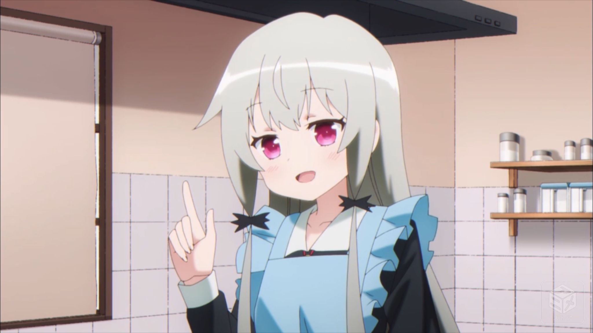

# 提名列表（2018追番记录）

|分類|タイトル|作品名|
|--------|--------|--------|
|剧场版|映画 中二病でも恋がしたい！ -Take On Me-|電影 中二病也想談戀愛！-Take On Me-|
|剧场版|さよならの朝に約束の花をかざろう|於離別之朝束起約定之花~（朝花夕誓）~|
|2018冬|A.I.C.O. -Incarnation-|A.I.C.O. -Incarnation-|
|2018冬|スロウスタート|Slow Start|
|2018冬|宇宙よりも遠い場所|比宇宙更遠的地方~（小南极）~|
|2018冬|りゅうおうのおしごと!|龍王的工作！~（萝莉的工作）~|
|2018冬|citrus|citrus ～柑橘味香氣～|
|2018冬|からかい上手の高木さん|擅長捉弄人的高木同學|
|2018冬|恋は雨上がりのように|愛在雨過天晴時~（恋如雨止）~|
|2018冬|三ツ星カラーズ|三顆星彩色冒險|
|2018冬|ヴァイオレット・エヴァーガーデン|紫罗兰永恒花园~（人类圣经）~|
|2018冬|B: The Beginning|B: The Beginning|
|剧场版|リズと青い鳥|莉兹与青鸟~（莉兹与迅雷）~|
|剧场版|名探偵コナン ゼロの執行人|名偵探柯南：零的執行人|
|2018冬|カードキャプターさくら クリアカード編|庫洛魔法使 透明牌篇|
|2018春|あさがおと加瀬さん。|牽牛花與加瀨同學。|
|2018春|こみっくがーるず|漫画女孩|
|2018春|多田くんは恋をしない|多田君不戀愛|
|2018春|ソードアート・オンライン オルタナティブ ガンゲイル・オンライン|刀劍神域外傳Gun Gale Online|
|2018春|進撃の巨人 Season3|進擊的巨人 Season3|
|2018冬|ダーリン・イン・ザ・フランキス|DARLING in the FRANXX~（国家队）~|
|剧场版|未来のミライ|未來的未來|
|2018春|フルメタル・パニック！ Invisible Victory|驚爆危機 Invisible Victory|
|剧场版|劇場版 のんのんびより ばけーしょん|劇場版 悠悠哉哉少女日和 Vacation|
|剧场版|君の膵臓をたべたい|我想吃掉你的胰臟|
|2018夏|ISLAND|ISLAND|
|2018夏|すのはら荘の管理人さん|春原莊的管理員小姐|
|2018夏|ちおちゃんの通学路|千緒的通學路|
|2018夏|はるかなレシーブ|遙的接球|
|2018夏|天狼 Sirius the Jaeger|天狼 Sirius the Jaeger|
|2018夏|ハイスコアガール|高分少女|
|2018春|ヒナまつり|極道超女|
|2018夏|あそびあそばせ|來玩遊戲吧|
|2018夏|はねバド!|輕羽飛揚|
|2018春|シュタインズ・ゲート ゼロ|STEINS;GATE 0|
|2018冬|ゆるキャン△|搖曳露營△|
|2018夏|少女☆歌劇 レヴュースタァライト|少女☆歌劇 Revue Starlight|
|2018秋|俺が好きなのは妹だけど妹じゃない|我喜歡的妹妹不是妹妹|
|2018秋|寄宿学校のジュリエット|寄宿學校的茱麗葉|
|2018秋|SSSS.GRIDMAN|SSSS.GRIDMAN|
|2018秋|色づく明日の世界から|來自繽紛世界的明日|
|2018秋|となりの吸血鬼さん|隔壁的吸血鬼美眉|
|2018秋|青春ブタ野郎はバニーガール先輩の夢を見ない|青春豬頭少年不會夢到兔女郎學姊|
|2018秋|ゴブリンスレイヤー|哥布林殺手|
|2018秋|やがて君になる|終將成為妳|
|2018秋|ソードアート・オンライン アリシゼーション|刀劍神域 Alicization|

# 真白赏：宇宙よりも遠い場所（比宇宙更遠的地方）

从第一话的最后，玉木マリ在床上辗转反侧，最终下定决心走出家门，买了一张前往広島的新幹線车票，踏进与平时反方向的电车的那一幕开始，随着耳边回荡着的「ハルカトオク」，我有一种预感，这部作品只要保持这个感觉做下去，**必成大器**。看完第一话，就有一种冲动，想去哪里旅行，想去尝试新的东西，想去体验非日常，很久没有一部作品会在如此开头的部分完全没有任何情感积累和铺垫的情况下就能给我如此的冲击（脚本是花田十輝，强，无敌）。抛开这些个人感受，这部作品很好的诠释了什么是青春，这部作品里的四位JK，各有各的生活，本应毫无交集，但是却为了同一个目标（阴差阳错的）走到了一起，虽然是夸张的充满戏剧性的目标————去南极，但是在前往南极的旅途中她们所表现出的个性与品质却是非常的真实，仿佛就是自己身边的某个人，或者就是观众自己。用普通而真实的角色去演绎一个伟大的故事，这之中的反差也是本作剧情性的一种表现方式。或许每个人都有过，坚持自己的想法勇敢与世界抗争的经历，可能我们最终都会变成自己曾经所讨厌的「大人」，但是————

[YouTube Video↓↓↓]

至少，就一次也好，能有底气向全世界喊出「ざまあみろ！」，应该是一件非常幸福的事情吧。

# 樱花赏：多田くんは恋をしない（多田君不戀愛）

2017年春季遇到了「月がきれい（月色真美）」，每周为两个初中生的恋爱揪的在地上滚来滚去（啊他们牵手了我死了），2018年的春季，「多田くんは恋をしない（多田君不戀愛）」让我难以抑制内心的波动在家里蹦来蹦去（卒）。其实是非常王道的恋爱作品，两人的身世设定，相遇，相恋，直至最后的高潮部分都很有各种早已熟知的套路的影子（嘛最后结局其实蛮意外的），但是反过来说，老梗之所以是老梗就是因为其广受欢迎，所以只要老梗安排的好其实也能作出很不错的作品。作为恋爱喜剧，其中安排的很多剧情都是十分活泼有趣，不知不觉就开始觉得里面的角色确实是非常可爱（妹妹真可爱prpr）。最后的高潮部分以及结局其实蛮意外的，毕竟之前flag也是插了蛮多的，再加上标题杀，本来以为大概是凉了的（快看是罗密欧与朱丽叶），结果最后真的激动哭了。喜欢恋爱喜剧的人应该会喜欢这部作品（ED翻唱的超好听）。

# 花火赏：はるかなレシーブ（遙的接球）

2018年夏天的记忆大概是这样的，6月在家自闭一边写毕业研究的程序一边听「FLY two BLUE」，7月在家自闭一边写毕业论文一边听「FLY two BLUE」，8月在家自闭一边写学会发表的论文一边听「FLY two BLUE」。2018年的夏季番其实挺迷的，很多日常番和搞笑番，本来十分期待的P.A.WORKS的「天狼 Sirius the Jaeger」高开低走，后期剧情莫名其妙，到头来印象最深的就是这个沙滩排球了，沙滩排球是次要的，关键是有海滩（天好热想去海边），还有沖縄（等忙完毕业论文去沖縄玩啦→未实现），还有泳装（prpr），夏天看真的是非常应景，压力大的时候看真的是非常解压非常爽（啊Kanata太可爱了我要找个沖縄妹子结婚啊）。芳文社的高校体育题材还是比较新奇（什么居然有主线剧情？），剧情方面中规中矩，就是很常规的那些，该有的都有。是萌豚都不会拒绝这部作品。OP和ED是真的好听。

# 枫叶赏：寄宿学校のジュリエット（寄宿學校的茱麗葉）

一看标题就有一种恶搞莎士比亚知名作品故意蹭热度吸眼球的恶俗恋爱片的感觉（肯定是什么垃圾轻改还是后宫卖肉的那种→卖肉是好文明），不过本身挺喜欢恋爱喜剧的就姑且试着看了一下（才，才不是为了听茅野愛衣说话呢～），结果第一话告白成功，全剧终（别人随便告白还是找的敌对势力的妹子都能一发成功，再看看自己……心灵受到重击，awsl）→→→然后就像嗑药一样根本停不下来，每周看这对小情侣克服万难打情骂俏，然后自己的心情也随着剧情忽高忽低，约会成功的时候，开心，仿佛跟茅野愛衣约会的是自己，恋情可能要曝光破局的时候，揪心，仿佛要跟茅野愛衣分手的是自己，蓮季哭的时候，伤心，仿佛失恋的是自己，蓮季哭的时候，伤心，我知道她脸上笑眯眯心里呜呜呜，手李亜害羞的时候，awsl，Persia害羞的时候，awsl，蓮季害羞的时候，awsl→一话大致死三次系列（等动画完结之后就去买了漫画全卷，然后一卷至少死十次）。Persia也是我很喜欢的那种女主角，可爱是一方面，其坚强勇敢，乐观积极的性格，以及为了守护自己的感情和理想而拼命努力的姿态是很耀眼的。漫画还没完结，已经在Amazon上follow作者，希望最后能有情人终成眷属，不要搞成莎士比亚那个罗密欧与朱丽叶那么惨。

# 剧场赏：リズと青い鳥（莉兹与青鸟）

实话说这个电影与当初期待的样子相去甚远，跟TV版的风格差异巨大，换了「聲の形」的staff，连带着叙事也含蓄了起来，相对于作品的时长，台词量是比较少的，很多时候在靠角色的动作和神态以及各种意象在表达意思，对观众的鉴赏能力要求比较高，在剧场看的时候大脑全程在思考，娱乐性实在谈不上很高（「聲の形」至少有几个喜剧和日常桥段来给予喘息），但是相对的，让观众去思考从而得出自己的理解，而不是直接用台词告诉观众正解，这种体验也是难得一见的。与本作同名的剧中剧与剧情双线并进，不断提醒你去思考作品剧情与剧中剧剧情的联系，最后对于谁是リズ谁是青い鳥还有一个意想不到的反转，就剧情设计和镜头表现来看着实是近年来难得一见的巧思。也正是因为这种画面之外的优秀素质使其力压岡田麿里的「さよならの朝に約束の花をかざろう（於離別之朝束起約定之花）」和同出自京都アニメション的「映画 中二病でも恋がしたい！ -Take On Me-（電影 中二病也想談戀愛！-Take On Me-）」赢得2018年剧场赏。

# 动作类优秀赏：少女☆歌劇 レヴュースタァライト（少女☆歌劇 Revue Starlight）

虽然是歌剧但是打戏是真的好看（这里不要在意为什么一个audition要打成这个样子）而且很多可爱的角色（关西腔好萌），最重要的是几乎每一话都打架，而且是一群妹子打架，就看得很爽。春季的「進撃の巨人 Season3」也是战斗很精彩但是它输出并不稳定，经常是痛快的打一场然后好久的文戏，就很难受（别说了快打爆吧，都5年了你们到底还去不去地下室啊）。剧情上也是可圈可点，而且作为卖歌番很多音乐也都很不错（OP买了）

# SF & Fantasy类优秀赏：SSSS.GRIDMAN

一看介绍就有一种恶搞円谷知名作品故意蹭热度吸眼球的恶俗萝卜片的感觉（肯定是什么垃圾改编还是卖基的那种→卖基是坏文明），然后不知不觉Twitter上就全是六花和Akane的色图……（prpr）于是就去看了一下结果第一话就惊了————为什么，为什么这么好看……OP和ED都好好听（OP movie帅爆了啊），玛雅制作是TRIGGER吹爆啊，woc六花俺の嫁……剧情整个实在很有系统地在推进，没有多余的话，也不会有特别压缩剧情的现象（点名批评「Charlotte」，明明话数不够用还要打棒球神经病），表面上是每一话打一个怪兽的单元剧，但是一次一次的战斗后剧情却在确实的推进着，下一话的战斗往往是在上一话的战斗的结果的延长线上。不过对于世界的描述感觉还是比较欠缺，这个世界是如何变成这样一个孤城，GRIDMAN是从何处来，天空里的倒立城市是什么，都没有明确的阐述。不过山寨王Anti最后变成Gridknight并激起「什么是人什么是怪兽」的讨论这一点是非常的不错，也是致敬了同为円谷プロ制作的奥特系列的一个核心理念「怪兽来自于丑恶的人心」。（虽然奖项分类叫SF&Fantasy类但是2017年的3个提名全部都是Fantasy系的，2018年终于轮到一个SF系的作品了，可喜可贺可喜可贺）

（想重新看一遍ULTRAMAN TIGA了，長野博和吉本多香美真的好看）

# 剧情类优秀赏：シュタインズ・ゲート ゼロ（STEINS;GATE 0）

STEINS;GATE的外传，展示了STEINS;GATE故事的「另一种可能性」，即围绕时间机器争夺的第三次世界大战，最后绕了一大圈，剧情收束至原点，使2010年的岡部倫太郎做出了「原本的选择」。由于是知名游戏改编动画所以只要动画化的时候不出太大问题，保持对原作故事的还原就可以做出很不错的东西，这次STEINS;GATE 0也给出了和本篇一样的2季时长，可以说是非常充裕了。这次的系列构成也很过分，话与话之间的分断设计的很气人，每次都是在关键时刻结束，留一个大大的悬念到下一周（没有下一话看我要死了）。总的来说STEINS;GATE 0延续了STEINS;GATE的优秀剧情，合理稳定的改编没有丢失太多要素，动画制作也没有什么问题，是一部能够专心享受剧情的优秀作品。

# 喜剧类优秀赏：あそびあそばせ（來玩遊戲吧）

这个番超神经病的，不过说到神经病，冬季的POP TEAM EPIC也是印象深刻，不过感觉那个有点太过了看了三话就放弃了，这部「あそびあそばせ（來玩遊戲吧）」维持了其原作漫画的诈欺属性，从Key Visual到PV甚至直至OP movie都是一副清纯女孩子的日常卖萌形象，结果本篇是emmm……太魔性了，但是却停不下来，笑死我了www

# 青春&学园类优秀赏：青春ブタ野郎はバニーガール先輩の夢を見ない（青春豬頭少年不會夢到兔女郎學姊）

**出现了！是鴨志田一！鴨志田一的作品通通吹爆！** 说实话鴨志田一对于思春期少年少女的小心思似乎有着独到的理解，其写的青春系作品对角色心里的刻画真的是入木三分，从「さくら荘のペットな彼女（樱花庄的宠物女孩）」到「Just Because!」，里面许多角色的台词和情感，经历过那个时代的人往往感同身受。这次的「青春ブタ野郎はバニーガール先輩の夢を見ない（青春豬頭少年不會夢到兔女郎學姊）」将这种著者特质发挥到了极致，直接将「思春期症候群」这个概念打了出来，表明了就是要讲各种思春期的破事，虽然表面上还是用量子力学之类的学说来包装了一下，不过应该也是随便找个手段来实现「思春期的各种困惑和烦恼会直接在现实生活中以某种方式具现化」这个剧情设计上的目的。与之较为相似的剧情设计让人想起「ココロコネクト（心連·情結）」这部作品，同样是各种思春期校园生活的心理压力引发各种奇异现象，「ココロコネクト（心連·情結）」没有设计任何奇异现象合理化的解释手段，直接搬出来一个叫「ふうせんかずら（風船葛）」的角色并且让其无所不能，实在是非常简单粗暴。「青春ブタ野郎はバニーガール先輩の夢を見ない（青春豬頭少年不會夢到兔女郎學姊）」这部作品里的各位女孩子也是各有魅力，角色对白也是十分有趣，光是听男主角对其他角色说骚话就已经构成愉悦的看点（草）。原作台版全卷已买，期待来年的剧场版。

# 恋爱类优秀赏：からかい上手の高木さん（擅長捉弄人的高木同學）

明明没有一丁点的谈情说爱，却能无时不刻看出「喜欢」这种心情，明明每一分钟都是喜剧，却让人笑着笑着就哭了（狗粮真香wuwuwu），这就是这部作品的神奇之处。据说小孩子表达对异性的喜欢或者在意的时候会有一种方式是去捉弄对方以吸引对方的注意，这部作品的年龄设定是中学生，也是一个不上不下的暧昧年纪，与剧情里的行为十分符合，高校生的话再用捉弄这种方式就会显得些许幼稚，小学生的话会受限于心智发展水平，有些剧情安上去会有违和感（CLAMP：听说你觉得小学生谈恋爱有违和感？），中学生的话就刚刚好，一方情窦初开却又拙于表达，另一方干脆就是完全钝感没有恋爱的意识，这样就又能构成一对剧情矛盾点。看着这一对每天各种神仙操作，同时高木さん还时不时流露出那种乙女心，真的是非常有趣。每一话不断变换的翻唱各种情歌的ED也是大大的加点（「小さな恋のうた」太好听了wuwuwu）。看完这个之后每每想到高橋李依配音的那句「ねぇ〜西片、」就不由自主嘴角上扬。跟其他恋爱作品不同，这部作品我反而希望原作永远不要完结，就看作者的灵感和创意能坚持多久了……

# 日常类优秀赏：劇場版 のんのんびより ばけーしょん（劇場版 悠悠哉哉少女日和 Vacation）

今年虽然一季一个芳文社，但是论日常系动画哪家强，还是要数「のんのんびより（悠悠哉哉少女日和）」。虽然之前睡前补番看TV版的时候经常半路睡着，但是这部剧场版，虽然是夜场看的，但是不仅不困，反而被剧中的悠闲气氛深深吸引。这次的剧场版说的是れんげ的哥哥（名字忘记了，不对，是从来就没有知道过名字）商场抽奖抽中了沖縄旅行于是大家一起去了沖縄県的石垣島旅行（沖縄！是沖縄！我要看沙滩排球啊！），然后夏海和下榻的民泊的女儿Aoi成为了好朋友的故事。基本上石垣島的主要观光项目都有涉及，差不多就是个石垣島观光宣传片了，看得我都想去了（我居然在剧场里看别人旅游还看的津津有味！）。最后一行人结束旅行回家，夏海和Aoi的告别场景居然十分感动（明明是个养老日常番！wuwuwu）

# 萌系优秀赏：となりの吸血鬼さん（隔壁的吸血鬼美眉）

今年虽然一季一个芳文社，但是论萌系动画哪家强，还是要数「となりの吸血鬼さん（隔壁的吸血鬼美眉）」。这部作品的素质是如此的高以至于获知其不是芳文社作品的时候十分震惊（什么！这个番居然不是芳文社！）。这部作品对吸血鬼设定的考究比较到位，很多细节都还原到了，而且这些吸血鬼的特质还被利用来制造故事，说明作者确实有用心考虑过和一个吸血鬼一起生活的话吸血鬼的种种特性会造成哪些问题。2017年的「亜人ちゃんは語りたい（亞人醬有話要說）」也是这样仔细考虑了各种亞人在实际的社会生活中会遇到的问题并以此来设计剧情。

萌系作品，说的再多都不如来一话感受一下索菲酱有多么可爱……

可爱↓↓↓

# 年度特别赏：カードキャプターさくら クリアカード編（庫洛魔法使 透明牌篇）

# 年度大赏：ソードアート・オンライン アリシゼーション（刀劍神域 Alicization）

